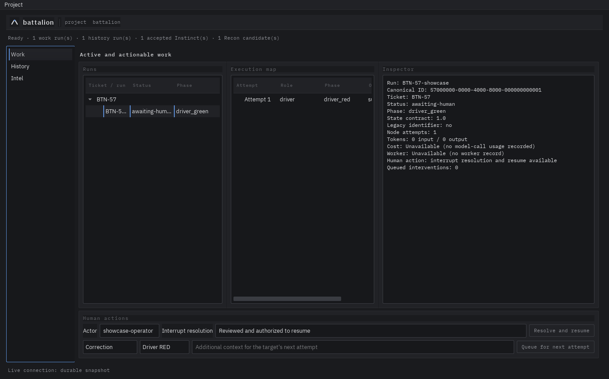

# Battalion

[](https://github.com/lrburkholder/battalion/actions/workflows/test.yml?query=branch%3Amain)
[](https://www.python.org/downloads/)
[](LICENSE)
[](https://lrburkholder.github.io/battalion)

<!-- Badge candidates reviewed and omitted (BTN-50): stars (popularity, not
health), contribution guidance (no CONTRIBUTING.md or contribution policy
yet), container registry (no published images), API/DeepWiki-style services
(third-party services Battalion has not adopted), and "PRs welcome" (no
contribution policy to back the claim). Add a badge only when its target and
claim become verifiable. -->

**Battalion is an AI-assisted software development workflow that keeps the human engineer in control.**

Instead of giving one AI model a task and hoping it handles every part correctly, Battalion breaks development work into specialized roles such as Architect, Driver, Reviewer, and Refactorer. It coordinates those roles through a defined workflow, enforces important boundaries in code, and pauses for human input when a decision needs human judgment.

Battalion is built on [LangGraph](https://github.com/langchain-ai/langgraph).

## Why Battalion?

Long-running AI coding sessions can easily mix responsibilities. A model that is supposed to implement a feature may start making architecture decisions. A reviewer may quietly fix code it was supposed to review. Important assumptions can disappear into the conversation.

Battalion makes those boundaries explicit and, where possible, mechanically enforced.

The basic approach is:

1. **Give each role a clear job.** An Architect plans. A Driver implements. A Reviewer reviews.
2. **Enforce important boundaries in code.** For example, roles can only write to files they have permission to change.
3. **Pause when human judgment matters.** Battalion interrupts the workflow for defined situations instead of silently deciding everything itself.
4. **Keep evidence of what happened.** Runs retain state, execution results, model usage, artifacts, and human decisions so the work can be inspected later.
5. **Learn from completed work.** Battalion can identify useful patterns from previous Runs and propose them for human-reviewed reuse.

The goal is not to remove the engineer from software development. The goal is to automate mechanical work while keeping important decisions visible and human-controlled.

## Battalion Builds Battalion

Battalion is developed using the same workflow it is intended to provide to other projects.

This is deliberate. The project is its own first real-world test. As Battalion gains capabilities, more of its development can run through Battalion while the human remains responsible for direction, architecture, and acceptance.

## Current Status

Battalion is currently **pre-1.0**.

The core graph, human interrupts, CLI, desktop application, persistence, execution evidence, and deterministic acceptance tests are implemented. Formal CLI UAT (BTN-129), desktop UAT (BTN-132), and external integration dogfooding (BTN-80) remain release gates after BTN-173's main-based candidate handoff.

Merging code to `main` does **not** mean that functionality has been accepted for release.

Current status is generated from canonical [GitHub Issues](https://github.com/lrburkholder/battalion/issues) and Milestones. See the [public status dashboard](https://lrburkholder.github.io/battalion/docs/status.html) for the current milestone-level view.

## How Battalion Works

A Battalion **Run** moves a development task through a graph of specialized roles.

A typical full workflow looks roughly like this:

```text
Human
  │
  ▼
Architect
  │
  ▼
Driver
  ├── RED: write the failing test
  └── GREEN: implement the change
  │
  ▼
Reviewer
  │
  ├── accepted ──────────────► Refactorer ──► complete
  │
  └── rejected ──────────────► Driver
```

Battalion can interrupt this flow when something requires human attention. The Run is saved so it can be inspected and, when safe, resumed.

Not every task needs the full workflow. Battalion also has compact workflow recipes for work that does not justify every role. Workflow admission can use deterministic evidence, Tactician assessment, and human decisions to select the appropriate path. Durable admission/Run linkage and CLI/desktop presentation remain BTN-143–144.

## Human Control

Battalion deliberately includes points where automation stops.

Version 1 defines six kinds of interrupts:

| Trigger | What Battalion does |
|---|---|
| Reviewer rejects the same root cause twice | Pauses and asks for human input |
| A role tries to write outside its allowed scope | Blocks the write |
| The Run exceeds its budget | Pauses, shows the spend, and asks whether to continue |
| A Battalion role definition is modified | Always pauses for human review |
| Infrastructure or execution fails | Saves the failure and pauses |
| The user requested a checkpoint | Pauses unconditionally |

These are part of Battalion's normal workflow, not exceptional escape hatches. Human involvement is intentional.

## Roles

The current core workflow uses these roles:

| Role | Responsibility |
|---|---|
| **Architect** | Plans the implementation and produces architecture artifacts |
| **Driver RED** | Writes the failing test without changing production code |
| **Driver GREEN** | Implements the smallest change needed to make the test pass |
| **Reviewer** | Reviews the result skeptically and independently runs tests |
| **Refactorer** | Improves accepted code without changing its behavior |
| **Recon** | Looks for useful patterns after completed work and proposes candidate Instincts |
| **Tactician** | Helps assess which workflow is appropriate before execution |

Role prompts are shipped with Battalion under `battalion/prompts/`. Architect, Driver, Reviewer, Refactorer, Recon, and Tactician each have owned prompt assets; Driver also has separate RED and GREEN prompts.

## Write Scopes

A role does not simply receive an instruction saying which files it may edit. Battalion limits the tools available to that role so writes outside its declared scope are blocked mechanically.

For example:

```yaml
write_scope:
  architect: ["plan.md"]
  driver_red: ["tests/"]
  driver_green: ["battalion/"]
  refactorer: ["battalion/"]
  reviewer: []
```

These paths are relative to the project root. Battalion rejects absolute paths, parent traversal, filesystem escapes, and whole-project write scopes such as `./`.

See [ADR-0002](docs/adrs/adr0002.md) and [ADR-0013](docs/adrs/adr0013.md) for the full design.

## Runs, Evidence, and Recovery

Battalion stores a versioned state record for each Run. Among other things, it records:

- the Run and project identity;
- the current ticket, phase, and status;
- each role's write permissions;
- reviewer rejection history and retry limits;
- budget use and interrupt history;
- human checkpoints and resume decisions;
- execution evidence, including model/token usage and known cost;
- role results and artifact provenance; and
- enough graph progress to distinguish safe recovery from an attempt whose outcome is unknown.

After a crash, `battalion status RUN_ID --human` and the desktop inspector show whether the Run can safely continue.

If generation started but Battalion did not save an outcome, replay may be unsafe. Inspect the execution record and workspace before deciding what to do next. Do not edit saved state to force a replay. Battalion does not promise exactly-once model calls or automatic rollback of file writes that happened before a crash.

See [Troubleshooting and recovery](docs/troubleshooting.md) for the complete recovery procedure.

## Getting Started

Before setup, read [Data handling and trust boundaries](docs/data-handling.md). It explains what project data may be sent to models, what Battalion stores locally, how credentials are handled, and what can appear in exported traces.

Then follow [Getting Started](docs/getting-started.md) to:

1. verify and install a Battalion build;
2. configure local or remote models;
3. validate provider connectivity; and
4. run a disposable ticket with an explicit human checkpoint.

Battalion requires **Python 3.11 or newer** for the CLI.

There is no public GitHub Release as of 2026-08-30. Until one exists, use only a named candidate supplied for UAT. Editable installs and developer dependencies are covered separately in [contributor setup](docs/contributing.md).

## Configure Models

Battalion can use local or remote inference through LiteLLM. Credentials are supplied through environment variables, not project configuration.

Driver and Reviewer must use different model identifiers. Setup validates one selected model per provider; passing that check does not guarantee that every model offered by the provider is compatible.

The [Getting Started model setup](docs/getting-started.md#4-choose-models-and-validate-configuration-live-provider-step) walks through configuration. The [data-handling guide](docs/data-handling.md#model-context) explains what each role may send to its model.

## Run Battalion

After installation and project setup, a basic PowerShell flow is:

```powershell
battalion run BTN-HELLO-1 --spec ticket.md --checkpoint driver
$RunId = Read-Host 'Paste the printed Run UUID'
battalion status $RunId --human
battalion status $RunId --costs --human
battalion resume $RunId --resolution 'Reviewed the plan and approved continuation'
```

New Runs print a canonical UUID. A ticket ID is not a Run ID.

Before resuming, inspect the interrupt and the work Battalion produced. `status --costs` shows persisted token use and known monetary cost by graph phase and model. Unknown cost remains explicitly unknown rather than being reported as zero.

Run `battalion <command> --help` for current CLI options. `python -m battalion <command>` is also supported in source-mode environments.

Raw streamed reasoning and token text can be exported with `--trace-output`. This is opt-in, local, and may contain sensitive provider text. Read [raw traces and sharing](docs/data-handling.md#traces) before enabling it.

## Desktop Application

Battalion also includes a PySide6 desktop client:

```bash
battalion-desktop --project .
```

The desktop application provides views for current work, Run history, execution evidence, accepted Intel, Recon candidates, and human interrupts. It can resolve supported interrupts, resume Runs, review Recon candidates, and queue supported corrections or design decisions for a role's next attempt.

The desktop client and execution worker are packaged separately so the UI does not need to include the full LangGraph/LiteLLM runtime.

### Preview the Production UI

[](https://lrburkholder.github.io/battalion/)

The public showcase uses the real PySide6 client with deterministic fictional data. It does not read a developer's Run state, provider configuration, or credentials.

See the [operator workflow](docs/ui/workflow.md) for the complete UI workflow and the [screenshot refresh procedure](docs/ui/showcase.md) for showcase details.

## Reviewer Test Execution

Reviewer runs pytest independently in a disposable snapshot of the project. The timeout is configured in `battalion.config.yaml`:

```yaml
reviewer_test_timeout_seconds: 300
```

RED requires an actual collected test to fail without a test-harness error. GREEN and REFACTOR require collected tests to pass. Missing tests, collection/setup errors, malformed results, launch failures, timeouts, and cancellations are treated as infrastructure failures rather than model judgments.

Reviewer has no project write tools. Its disposable snapshot is designed to isolate test execution from the working project, but it is **not** an operating-system security sandbox.

## Integrations

Battalion has portable integration boundaries for work sources, knowledge sources, repository services, notifications, outbound events, and human interaction.

Project-shareable bindings live in `battalion.integrations.yaml`. Credentials do not. Configuration stores symbolic references such as:

```yaml
credential_references:
  authorization:
    reference: env://AUTOMATION_WEBHOOK_AUTHORIZATION
```

The built-in outbound adapters currently include vendor-neutral HTTP webhooks and a narrower Discord webhook sink. Outbound delivery uses Battalion's durable side-effect ledger and idempotency identities so retries can be reconciled safely.

Declaring an integration does not automatically authorize or implement every operation. Configuration, provider adapters, credential resolution, health checks, Actor permissions, and operation authorization remain separate boundaries.

Ordinary CLI/worker execution does not yet construct the full integration runtime from YAML alone.

See [integration data handling](docs/data-handling.md#integrations) and [credential placement](docs/data-handling.md#credentials) before enabling integrations.

## Intel and Recon

After completed work, Recon can propose reusable patterns called **candidate Instincts**.

Candidates are stored under:

```text
<project>/.battalion/recon/candidates/
```

They are create-only. Human review can promote, edit-and-promote, or reject a candidate, but the original evidence is preserved. Review decisions are stored separately under `.battalion/recon/decisions/` so Battalion retains an audit trail.

Accepted Instincts can later be selected deterministically and injected into bounded role context.

## Roadmap

Major remaining or future work includes:

- **Desktop v2:** history search and model-by-role analytics (BTN-44).
- **Inference policy:** endpoint-aware inference identity and zero-cost policy (BTN-52–55; RFC-0005 / ADR-0024).
- **Actors:** capability enforcement, assignment/ownership, and authentication (BTN-60–62; RFC-0007 / ADR-0026).
- **Integrations:** operation policy and health, email/push adapters, and MCP transport (BTN-68–69, BTN-76–78).
- **Workflow admission:** durable admission/Run linkage and CLI/desktop presentation (BTN-143–144), plus separate Review Run work.
- **Future RFCs:** Specifier (BTN-45), plugin architecture (BTN-46), severity-based review and possible Guardian role (BTN-47), bounded self-modification (BTN-48), and pluggable repository quality gates (BTN-49).

Draft future briefs live under `docs/future/`. They do not change Battalion's current roles or authority until their RFCs are accepted.

The former Teacher concept is no longer planned as a Battalion role. It is expected to become **Dojo**, a separate future application. Researcher workflows may also belong in a separate application; that boundary is still unresolved.

## Architecture and Components

The main implementation areas are:

| Area | Purpose |
|---|---|
| `battalion.state` | Versioned Run state and local persistence |
| `battalion.application` | Shared typed boundary used by CLI and desktop clients |
| `battalion.actors` | Human/system Actor identity and project-local persistence |
| `battalion.identity` | Run/project identity and catalogs |
| `battalion.workers` | Detached per-Run execution and reconnect support |
| `battalion.observation` | Live event ordering, deduplication, and reconnect cursors |
| `battalion.execution` | Durable execution, artifact, usage, and cost evidence |
| `battalion.role_results` | Typed role-result validation |
| `battalion.context` | Bounded model context assembly |
| `battalion.scope` | Mechanical write-scope enforcement |
| `battalion.llm` | Per-role model access through LiteLLM |
| `battalion.nodes` | Architect, Driver, Reviewer, Refactorer, and Recon roles |
| `battalion.graph` | LangGraph workflow wiring and interrupts |
| `battalion.interrupts` | Interrupt triggers and budget tracking |
| `battalion.intel` | Recon candidates, review, accepted Instincts, and retrieval |
| `battalion.integrations` | Portable integration configuration, runtime, and side effects |
| `battalion.notifications` | Actor-targeted notification routing |
| `battalion.desktop` | PySide6 operator application |
| `battalion.cli` | Typer command-line interface |

For implementation provenance, individual BTN tickets, and exact internal contracts, see the source tree, [GitHub Issues](https://github.com/lrburkholder/battalion/issues), and the [ADR index](docs/adrs/README.md).

## Design Principles

Battalion's architecture is documented through Architecture Decision Records. Important examples include:

- [ADR-0001](docs/adrs/adr0001.md): all roles share one versioned state contract.
- [ADR-0002](docs/adrs/adr0002.md): write permissions are enforced structurally through tool binding.
- [ADR-0003](docs/adrs/adr0003.md): the CLI is a presentation layer over a shared application boundary rather than a separate implementation of Run behavior.
- [ADR-0035](docs/adrs/adr0035.md): Battalion may make one bounded correction attempt when it mechanically detects a pre-write role-contract mistake.

See the [complete ADR index](docs/adrs/README.md) for all accepted architecture decisions and their implementation status.

## Development

Run the test suite with:

```bash
python -m pytest
```

Optional coverage:

```bash
python -m pip install pytest-cov
python -m pytest --cov=battalion --cov-report=term-missing
```

Battalion's main dependencies are:

- Python 3.11+
- LangGraph
- Pydantic
- LiteLLM
- Typer
- PyYAML
- pytest for development and testing

See [contributor setup](docs/contributing.md) for the complete development environment.

## Contributing

1. Fork and clone the repository.
2. Create a branch for your changes.
3. Add tests for new functionality.
4. Run the existing tests.
5. Submit a pull request.

Significant work is tracked in canonical [GitHub Issues](https://github.com/lrburkholder/battalion/issues). Tickets use the `BTN-#` format and carry dependencies, acceptance criteria, lifecycle status, and classification labels.

## Releases

Battalion is pre-1.0. The application/package version is declared in `pyproject.toml`. A maintainer-created matching tag, such as `v0.1.0`, is the release trigger; merges and pushes to `main` do not publish artifacts.

See the [release and distribution guide](docs/release.md) for SemVer policy, release gates, GitHub Release artifacts and checksums, Windows desktop packaging, and first-run onboarding.

## License

MIT License - Copyright (c) 2026 Luke Burkholder

See [LICENSE](LICENSE) for the full license text.

---

*Built with LangGraph, Pydantic, and LiteLLM.*  
*Dogfooding: Battalion's first project is itself.*
